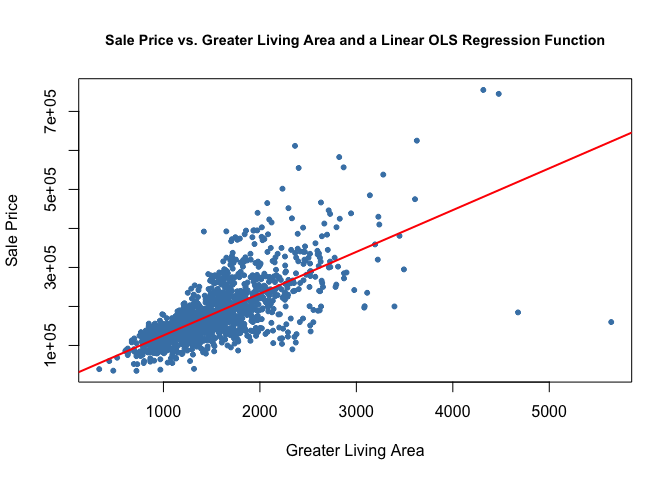
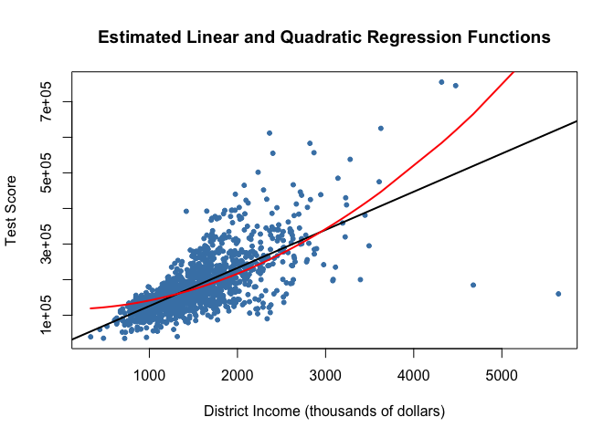
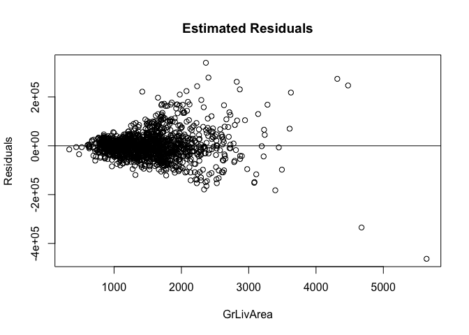
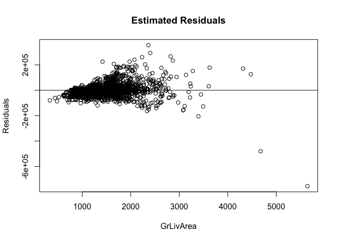

HousePricing\_Modeling
================

## R Markdown

This document shows how to build a linear regression model and
non-linear regression model from the house pricing dataset by comparing
the Sale Prices with GrLivingArea

``` r
house_prices <- read.csv("~/Desktop/MontecCarloSimulation/train.csv")
str(house_prices)
```

    ## 'data.frame':    1460 obs. of  81 variables:
    ##  $ Id           : int  1 2 3 4 5 6 7 8 9 10 ...
    ##  $ MSSubClass   : int  60 20 60 70 60 50 20 60 50 190 ...
    ##  $ MSZoning     : Factor w/ 5 levels "C (all)","FV",..: 4 4 4 4 4 4 4 4 5 4 ...
    ##  $ LotFrontage  : int  65 80 68 60 84 85 75 NA 51 50 ...
    ##  $ LotArea      : int  8450 9600 11250 9550 14260 14115 10084 10382 6120 7420 ...
    ##  $ Street       : Factor w/ 2 levels "Grvl","Pave": 2 2 2 2 2 2 2 2 2 2 ...
    ##  $ Alley        : Factor w/ 2 levels "Grvl","Pave": NA NA NA NA NA NA NA NA NA NA ...
    ##  $ LotShape     : Factor w/ 4 levels "IR1","IR2","IR3",..: 4 4 1 1 1 1 4 1 4 4 ...
    ##  $ LandContour  : Factor w/ 4 levels "Bnk","HLS","Low",..: 4 4 4 4 4 4 4 4 4 4 ...
    ##  $ Utilities    : Factor w/ 2 levels "AllPub","NoSeWa": 1 1 1 1 1 1 1 1 1 1 ...
    ##  $ LotConfig    : Factor w/ 5 levels "Corner","CulDSac",..: 5 3 5 1 3 5 5 1 5 1 ...
    ##  $ LandSlope    : Factor w/ 3 levels "Gtl","Mod","Sev": 1 1 1 1 1 1 1 1 1 1 ...
    ##  $ Neighborhood : Factor w/ 25 levels "Blmngtn","Blueste",..: 6 25 6 7 14 12 21 17 18 4 ...
    ##  $ Condition1   : Factor w/ 9 levels "Artery","Feedr",..: 3 2 3 3 3 3 3 5 1 1 ...
    ##  $ Condition2   : Factor w/ 8 levels "Artery","Feedr",..: 3 3 3 3 3 3 3 3 3 1 ...
    ##  $ BldgType     : Factor w/ 5 levels "1Fam","2fmCon",..: 1 1 1 1 1 1 1 1 1 2 ...
    ##  $ HouseStyle   : Factor w/ 8 levels "1.5Fin","1.5Unf",..: 6 3 6 6 6 1 3 6 1 2 ...
    ##  $ OverallQual  : int  7 6 7 7 8 5 8 7 7 5 ...
    ##  $ OverallCond  : int  5 8 5 5 5 5 5 6 5 6 ...
    ##  $ YearBuilt    : int  2003 1976 2001 1915 2000 1993 2004 1973 1931 1939 ...
    ##  $ YearRemodAdd : int  2003 1976 2002 1970 2000 1995 2005 1973 1950 1950 ...
    ##  $ RoofStyle    : Factor w/ 6 levels "Flat","Gable",..: 2 2 2 2 2 2 2 2 2 2 ...
    ##  $ RoofMatl     : Factor w/ 8 levels "ClyTile","CompShg",..: 2 2 2 2 2 2 2 2 2 2 ...
    ##  $ Exterior1st  : Factor w/ 15 levels "AsbShng","AsphShn",..: 13 9 13 14 13 13 13 7 4 9 ...
    ##  $ Exterior2nd  : Factor w/ 16 levels "AsbShng","AsphShn",..: 14 9 14 16 14 14 14 7 16 9 ...
    ##  $ MasVnrType   : Factor w/ 4 levels "BrkCmn","BrkFace",..: 2 3 2 3 2 3 4 4 3 3 ...
    ##  $ MasVnrArea   : int  196 0 162 0 350 0 186 240 0 0 ...
    ##  $ ExterQual    : Factor w/ 4 levels "Ex","Fa","Gd",..: 3 4 3 4 3 4 3 4 4 4 ...
    ##  $ ExterCond    : Factor w/ 5 levels "Ex","Fa","Gd",..: 5 5 5 5 5 5 5 5 5 5 ...
    ##  $ Foundation   : Factor w/ 6 levels "BrkTil","CBlock",..: 3 2 3 1 3 6 3 2 1 1 ...
    ##  $ BsmtQual     : Factor w/ 4 levels "Ex","Fa","Gd",..: 3 3 3 4 3 3 1 3 4 4 ...
    ##  $ BsmtCond     : Factor w/ 4 levels "Fa","Gd","Po",..: 4 4 4 2 4 4 4 4 4 4 ...
    ##  $ BsmtExposure : Factor w/ 4 levels "Av","Gd","Mn",..: 4 2 3 4 1 4 1 3 4 4 ...
    ##  $ BsmtFinType1 : Factor w/ 6 levels "ALQ","BLQ","GLQ",..: 3 1 3 1 3 3 3 1 6 3 ...
    ##  $ BsmtFinSF1   : int  706 978 486 216 655 732 1369 859 0 851 ...
    ##  $ BsmtFinType2 : Factor w/ 6 levels "ALQ","BLQ","GLQ",..: 6 6 6 6 6 6 6 2 6 6 ...
    ##  $ BsmtFinSF2   : int  0 0 0 0 0 0 0 32 0 0 ...
    ##  $ BsmtUnfSF    : int  150 284 434 540 490 64 317 216 952 140 ...
    ##  $ TotalBsmtSF  : int  856 1262 920 756 1145 796 1686 1107 952 991 ...
    ##  $ Heating      : Factor w/ 6 levels "Floor","GasA",..: 2 2 2 2 2 2 2 2 2 2 ...
    ##  $ HeatingQC    : Factor w/ 5 levels "Ex","Fa","Gd",..: 1 1 1 3 1 1 1 1 3 1 ...
    ##  $ CentralAir   : Factor w/ 2 levels "N","Y": 2 2 2 2 2 2 2 2 2 2 ...
    ##  $ Electrical   : Factor w/ 5 levels "FuseA","FuseF",..: 5 5 5 5 5 5 5 5 2 5 ...
    ##  $ X1stFlrSF    : int  856 1262 920 961 1145 796 1694 1107 1022 1077 ...
    ##  $ X2ndFlrSF    : int  854 0 866 756 1053 566 0 983 752 0 ...
    ##  $ LowQualFinSF : int  0 0 0 0 0 0 0 0 0 0 ...
    ##  $ GrLivArea    : int  1710 1262 1786 1717 2198 1362 1694 2090 1774 1077 ...
    ##  $ BsmtFullBath : int  1 0 1 1 1 1 1 1 0 1 ...
    ##  $ BsmtHalfBath : int  0 1 0 0 0 0 0 0 0 0 ...
    ##  $ FullBath     : int  2 2 2 1 2 1 2 2 2 1 ...
    ##  $ HalfBath     : int  1 0 1 0 1 1 0 1 0 0 ...
    ##  $ BedroomAbvGr : int  3 3 3 3 4 1 3 3 2 2 ...
    ##  $ KitchenAbvGr : int  1 1 1 1 1 1 1 1 2 2 ...
    ##  $ KitchenQual  : Factor w/ 4 levels "Ex","Fa","Gd",..: 3 4 3 3 3 4 3 4 4 4 ...
    ##  $ TotRmsAbvGrd : int  8 6 6 7 9 5 7 7 8 5 ...
    ##  $ Functional   : Factor w/ 7 levels "Maj1","Maj2",..: 7 7 7 7 7 7 7 7 3 7 ...
    ##  $ Fireplaces   : int  0 1 1 1 1 0 1 2 2 2 ...
    ##  $ FireplaceQu  : Factor w/ 5 levels "Ex","Fa","Gd",..: NA 5 5 3 5 NA 3 5 5 5 ...
    ##  $ GarageType   : Factor w/ 6 levels "2Types","Attchd",..: 2 2 2 6 2 2 2 2 6 2 ...
    ##  $ GarageYrBlt  : int  2003 1976 2001 1998 2000 1993 2004 1973 1931 1939 ...
    ##  $ GarageFinish : Factor w/ 3 levels "Fin","RFn","Unf": 2 2 2 3 2 3 2 2 3 2 ...
    ##  $ GarageCars   : int  2 2 2 3 3 2 2 2 2 1 ...
    ##  $ GarageArea   : int  548 460 608 642 836 480 636 484 468 205 ...
    ##  $ GarageQual   : Factor w/ 5 levels "Ex","Fa","Gd",..: 5 5 5 5 5 5 5 5 2 3 ...
    ##  $ GarageCond   : Factor w/ 5 levels "Ex","Fa","Gd",..: 5 5 5 5 5 5 5 5 5 5 ...
    ##  $ PavedDrive   : Factor w/ 3 levels "N","P","Y": 3 3 3 3 3 3 3 3 3 3 ...
    ##  $ WoodDeckSF   : int  0 298 0 0 192 40 255 235 90 0 ...
    ##  $ OpenPorchSF  : int  61 0 42 35 84 30 57 204 0 4 ...
    ##  $ EnclosedPorch: int  0 0 0 272 0 0 0 228 205 0 ...
    ##  $ X3SsnPorch   : int  0 0 0 0 0 320 0 0 0 0 ...
    ##  $ ScreenPorch  : int  0 0 0 0 0 0 0 0 0 0 ...
    ##  $ PoolArea     : int  0 0 0 0 0 0 0 0 0 0 ...
    ##  $ PoolQC       : Factor w/ 3 levels "Ex","Fa","Gd": NA NA NA NA NA NA NA NA NA NA ...
    ##  $ Fence        : Factor w/ 4 levels "GdPrv","GdWo",..: NA NA NA NA NA 3 NA NA NA NA ...
    ##  $ MiscFeature  : Factor w/ 4 levels "Gar2","Othr",..: NA NA NA NA NA 3 NA 3 NA NA ...
    ##  $ MiscVal      : int  0 0 0 0 0 700 0 350 0 0 ...
    ##  $ MoSold       : int  2 5 9 2 12 10 8 11 4 1 ...
    ##  $ YrSold       : int  2008 2007 2008 2006 2008 2009 2007 2009 2008 2008 ...
    ##  $ SaleType     : Factor w/ 9 levels "COD","Con","ConLD",..: 9 9 9 9 9 9 9 9 9 9 ...
    ##  $ SaleCondition: Factor w/ 6 levels "Abnorml","AdjLand",..: 5 5 5 1 5 5 5 5 1 5 ...
    ##  $ SalePrice    : int  208500 181500 223500 140000 250000 143000 307000 200000 129900 118000 ...

``` r
cor(house_prices$SalePrice, house_prices$GrLivArea)
```

    ## [1] 0.7086245

``` r
# fit a simple linear model
linear_model<- lm(SalePrice ~ GrLivArea, data = house_prices)

# plot the observations
plot(house_prices$GrLivArea, house_prices$SalePrice,
     col = "steelblue",
     pch = 20,
     xlab = "Greater Living Area", 
     ylab = "Sale Price",
     cex.main = 0.9,
     main = "Sale Price vs. Greater Living Area and a Linear OLS Regression Function")

# add the regression line to the plot
abline(linear_model, 
       col = "red", 
       lwd = 2)
```

<!-- -->

``` r
# obtain the model summary
library(lmtest)
```

    ## Loading required package: zoo

    ## 
    ## Attaching package: 'zoo'

    ## The following objects are masked from 'package:base':
    ## 
    ##     as.Date, as.Date.numeric

``` r
coeftest(linear_model)
```

    ## 
    ## t test of coefficients:
    ## 
    ##               Estimate Std. Error t value  Pr(>|t|)    
    ## (Intercept) 18569.0259  4480.7545  4.1442 3.607e-05 ***
    ## GrLivArea     107.1304     2.7936 38.3482 < 2.2e-16 ***
    ## ---
    ## Signif. codes:  0 '***' 0.001 '**' 0.01 '*' 0.05 '.' 0.1 ' ' 1

``` r
# fit the quadratic Model
quadratic_model <- lm(SalePrice ~ I(GrLivArea^2), data = house_prices)

# obtain the model summary
coeftest(quadratic_model)
```

    ## 
    ## t test of coefficients:
    ## 
    ##                  Estimate Std. Error t value  Pr(>|t|)    
    ## (Intercept)    1.1634e+05 2.5196e+03  46.175 < 2.2e-16 ***
    ## I(GrLivArea^2) 2.5103e-02 7.6400e-04  32.858 < 2.2e-16 ***
    ## ---
    ## Signif. codes:  0 '***' 0.001 '**' 0.01 '*' 0.05 '.' 0.1 ' ' 1

``` r
# draw a scatterplot of the observations for income and test score
plot(house_prices$GrLivArea, house_prices$SalePrice,
     col  = "steelblue",
     pch = 20,
     xlab = "District Income (thousands of dollars)",
     ylab = "Test Score",
     main = "Estimated Linear and Quadratic Regression Functions")

# add a linear function to the plot
abline(linear_model, col = "black", lwd = 2)

# add quatratic function to the plot
order_id <- order(house_prices$GrLivArea)

lines(x = house_prices$GrLivArea[order_id], 
      y = fitted(quadratic_model)[order_id],
      col = "red", 
      lwd = 2) 
```

<!-- -->

``` r
linear_res = resid(linear_model)

plot(house_prices$GrLivArea, linear_res, 
     ylab="Residuals", xlab="GrLivArea", 
    main="Estimated Residuals") 
abline(0, 0)    
```

<!-- -->

``` r
quad_res = resid(quadratic_model)

plot(house_prices$GrLivArea, quad_res, 
     ylab="Residuals", xlab="GrLivArea", 
    main="Estimated Residuals") 
abline(0, 0)    
```

<!-- -->
